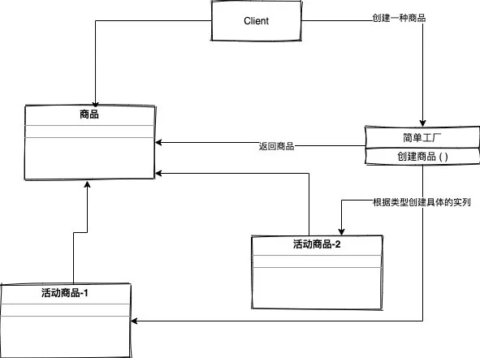
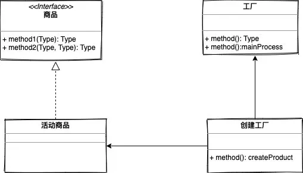
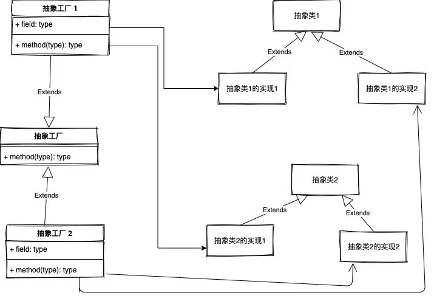

# 工厂模式
工厂模式主要是用于对实现逻辑的封装，并且通过对公共的接口提供对象的实列化的服务，在我添加新的类时不需大动干戈，只要修改一点点就好。  

工厂模式主要可以分为三大类：
- 简单工厂模式
- 工厂方法模式
- 抽象工程模式

## 简单工厂模式

## 工厂方法模式
工厂方法模式是对静态工厂模式的上的一种改进，我们的工厂类直接被抽象化，需要具体特定化的逻辑代码转移到实现抽象方法的子类中，这样我们就不要再去修改工厂类（即：不用再去做什么if else 修改）这也是我们当前比较常用的一种方式。

## 抽象工厂模式
理解了工厂方法模式，再理解抽象工厂模式就更加简单，因为它其实就是工厂方法的一个延伸。

工厂方法类中只有一个抽象方法，要想实现多种不同的类对象，只能去创建不同的具体工厂方法的子类来实列化，而抽象工厂 则是让一个工厂负责创建多个不同类型的对象

感觉理解起来有点绕，我们还是来画个图吧

从上图来看，抽象工厂模式可以分为以下几个部分：
- 抽象工厂类
- 具体工厂类
- 抽象类  

抽象工厂类我个人可以理解为一个刚出厂的手机，具体抽象工厂这是认为我们每个人对这个手机壁纸自定义设置，最后抽象类我理解就是手机壁纸。

## 什么时候该用工厂方法模式，而非简单工厂模式呢？

这里引用设计模式之美里面的一句话：当对象的创建逻辑比较复杂，不只是简单的 new 一下就可以，而是要组合其他类对象，做各种初始化操作的时候，我们推荐使用工厂方法模式，将复杂的创建逻辑拆分到多个工厂类中，让每个工厂类都不至于过于复杂。

而使用简单工厂模式，将所有的创建逻辑都放到一个工厂类中，会导致这个工厂类变得很复杂