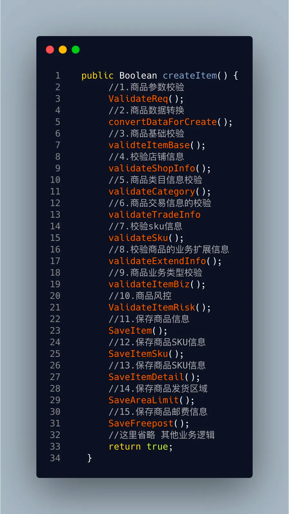
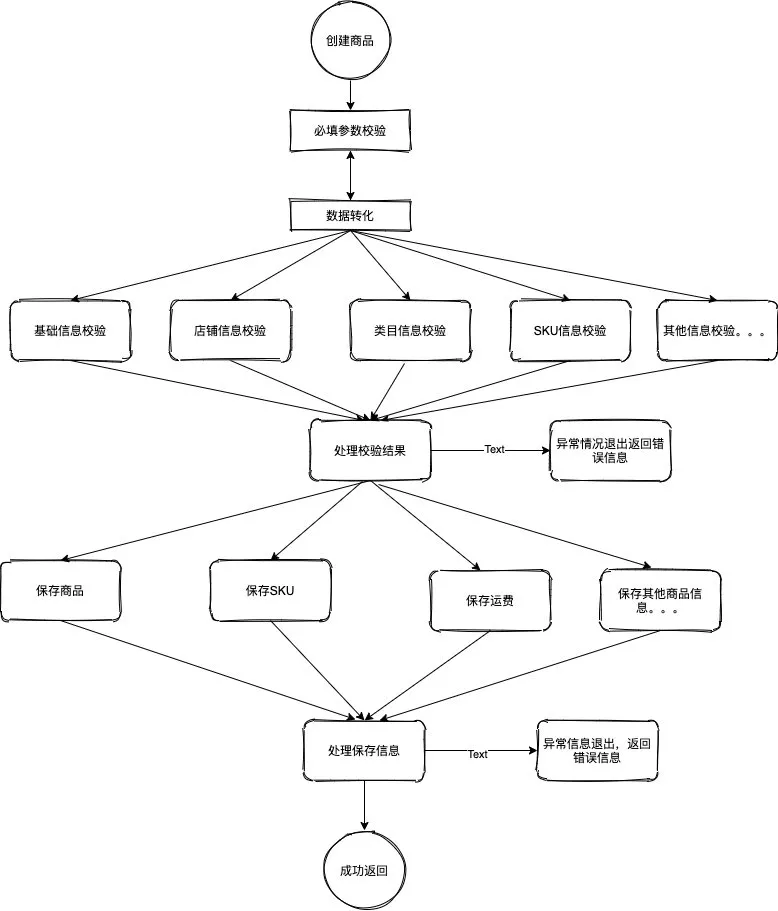
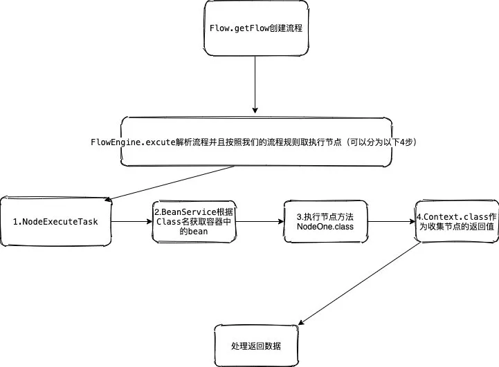

## 流程引擎模式
当业务上某项操作需要执行多个逻辑，且这些逻辑存在可并行的业务，可以通过流程引擎进行优化  

传统方式

使用流程引擎

## 问题
### 细心的同学可能会发现这都是强依赖性，能不能有弱依赖在里面呢？

答案：当然可以有弱依赖了，在 FlowNode.NodeConf中我们既然可以设置超时时间 我们也可以在添加一个参数来确定是都是弱依赖。在我们的future.get获取结果的时候当出现异常可以catch住，强依赖则终止流程返回错误信息，否则记录错误日志，流程continue

### 我们流程保存现在是用的静态代码块，可不可以换其他的方式保存节点呢？

答案：这个当然也可以，我们保存在数据库，ACM，Apollo等等都是可以的。这个取决于你们自己的业务和成本问题。因为流程我们一般是不会经常换的，所以我还是建议代码写死就好了

### 采用线程池去调用下游服务，会不会造成服务链路追踪失败呢？

答案：这个不能说绝对，但是如果是保存在ThreadLocal中那肯定是会失效的，ThreadLocal中的KEY也就跟当前线程的ID有关，都开启新的线程了，那肯定也就是丢失了